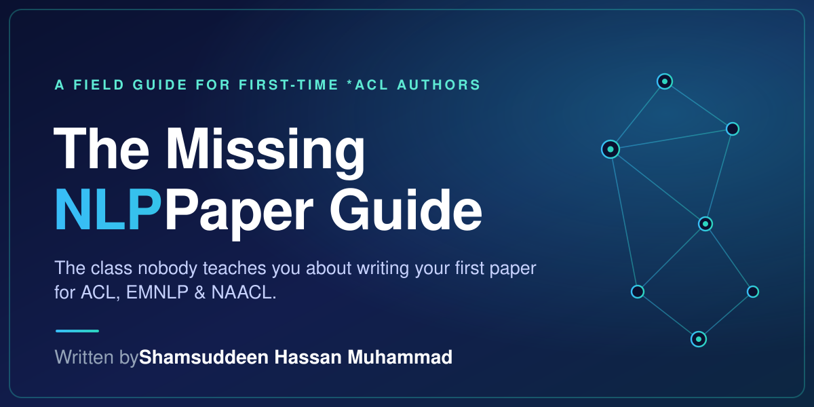

# The Missing NLP Paper Guide

**The class nobody teaches you — how to actually write your first paper for ACL, EMNLP, NAACL, and the rest of the \*ACL family.**

---

## Why this exists

There is a class your PhD program does not teach. Your advisor assumes you picked it up by osmosis. Your peers pretend they already know it. The official ACL author guidelines tell you the *format* of a paper — margins, citation style, page limits — but not the *craft*. How do you actually frame a contribution? What goes in a related work section that is not just a list of citations? Why does your introduction feel flat? Why did the reviewer say your results section was "hard to follow" when the numbers are right there?

This is that missing class. It borrows its spirit from MIT's [Missing Semester of Your CS Education](https://missing.csail.mit.edu/) — the course that finally taught students the command line, version control, and the everyday tools nobody had bothered to explain — and tries to do the same for the craft of writing an \*ACL paper. Think of it as the methods seminar your program forgot to schedule.

## Who it is for

- **First-time \*ACL authors** — PhD and master's students, or researchers in industry, who have a result and a deadline.
- **Advisors** who would rather hand a new student one good document than explain the same things every cycle.
- **Reading groups** spending an afternoon on how papers are actually built.

If you have already published five or more first-author \*ACL papers, this guide is probably beneath you. We would still be glad of your help making it better.

## What you get

- **Twenty-eight chapters** that follow a paper through its whole life — from choosing a venue, to drafting each section, to answering the reviews.
- **Examples from real papers.** Every one points to a genuine paper on the ACL Anthology. None are invented.
- **A phrasebook of rhetorical moves.** The actual openings, pivots, and closings of highly cited papers, sorted by the job each sentence does — context, gap, proposal, method, result, implication. It is modeled on the [Manchester Academic Phrasebook](https://www.phrasebank.manchester.ac.uk/), but tuned to \*ACL habits and drawn from real papers rather than generic academic English.
- **A [printable one-page submission checklist](/checklists/submission-checklist)** for the night before the deadline.
- **A `papers-to-read.bib`** of every paper cited in Chapter 27, ready to drop straight into Overleaf.
- **A [structured examples database](/examples/)** you can browse by section or by paper.

## What it is not

- **Not the official rules.** For format, page limits, anonymity, and the Responsible NLP Checklist, follow the [ACL Rolling Review CFP](https://aclrollingreview.org/cfp) and the [ACLPUB formatting page](https://acl-org.github.io/ACLPUB/formatting.html). Where they and this guide disagree, they win.
- **Not machine-written filler.** Every example is a real paper you can open and read on the [ACL Anthology](https://aclanthology.org).
- **Not a replacement for reading great papers.** It will tell you what to look for; the papers themselves still do the teaching. Chapter 27 lists the ones to start with.

## How to use it

You do not have to read it in order. Find the row that fits your week and begin there.

| Where you are | Where to start |
|---|---|
| **Speed run** — deadline in two weeks, draft mostly done | [9 The Abstract](./chapters/abstract), [10 The Introduction](./chapters/introduction), [16 Results](./chapters/results), [19 Limitations](./chapters/limitations), [28 Final Checklist](./chapters/checklist) |
| **First paper** — six to eight weeks out | Every chapter, in order |
| **New to NLP** — still deciding where to submit | [1 Publication Landscape](./chapters/publication-landscape), [2 What Kind of Paper](./chapters/paper-types), [4 Framing](./chapters/framing), [27 Best Papers](./chapters/best-papers) |
| **Studying the craft** — no deadline, want to get better | [4 Framing](./chapters/framing), [6 Writing Clearly](./chapters/writing-clearly), [27 Best Papers](./chapters/best-papers), then any chapter that draws you in |
| **Reviewing**, not writing | [24 How to Review Well](./chapters/reviewing), [17 Analysis and Discussion](./chapters/analysis), [19 Limitations](./chapters/limitations) |

## The chapters

1. [The NLP Publication Landscape](./chapters/publication-landscape)
2. [What Kind of Paper Are You Writing?](./chapters/paper-types)
3. [Decoding the Jargon](./chapters/jargon)
4. [Framing the Contribution](./chapters/framing)
5. [Working with Advisors and Co-authors](./chapters/collaboration)
6. [Writing Clearly](./chapters/writing-clearly)
7. [Figures and Tables That Work](./chapters/figures-and-tables)
8. [The Title](./chapters/title)
9. [The Abstract](./chapters/abstract)
10. [The Introduction](./chapters/introduction)
11. [Related Work](./chapters/related-work)
12. [Background and Preliminaries](./chapters/background)
13. [Dataset Construction](./chapters/dataset-construction)
14. [Methods](./chapters/methods)
15. [Experimental Setup](./chapters/experimental-setup)
16. [Results](./chapters/results)
17. [Analysis and Discussion](./chapters/analysis)
18. [Conclusion](./chapters/conclusion)
19. [Limitations](./chapters/limitations)
20. [Ethical Considerations](./chapters/ethics)
21. [Using AI Tools Responsibly](./chapters/ai-assistance)
22. [References, Appendices, and Reproducibility](./chapters/references-and-appendices)
23. [The Rebuttal](./chapters/rebuttal)
24. [How to Review Well](./chapters/reviewing)
25. [After Rejection](./chapters/after-rejection)
26. [After Acceptance](./chapters/after-acceptance)
27. [Best Papers Worth Reading](./chapters/best-papers)
28. [A Final Checklist](./chapters/checklist)

## Contributing

Please do. The guide gets better every time an experienced author adds what they learned the hard way. Start with [CONTRIBUTING.md](https://github.com/shmuhammadd/missing-guide-nlp/blob/main/CONTRIBUTING.md) in the repository.

## License

Released under [CC BY 4.0](https://github.com/shmuhammadd/missing-guide-nlp/blob/main/LICENSE). Use it, fork it, translate it, hand it to your students. Attribution is appreciated.
